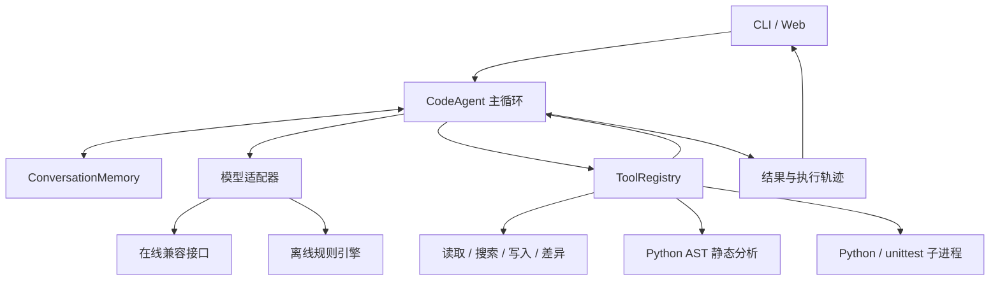

# 代码助手 Agent 设计文档

## 目标与取舍

通过代码助手实现可检查的 Agent 循环，支持代码审查、解释、生成、测试生成和重构建议，并提供项目扫描与 Git 改动审查。使用原生兼容 API 和 Python 标准库，降低安装与维护成本。主循环、工具和模型适配器保持分离，便于以后替换为其他模型或框架。

## 架构

| 模块 | 职责 |
| --- | --- |
| `config.py` | 环境变量与 .env、参数覆盖、路径与范围归一化 |
| `modes.py` / `prompts.py` | 模式识别、任务输出约定、工具策略与公共规则 |
| `llm.py` | 请求、重试、响应解析、离线流程 |
| `agent.py` | 模型与工具之间的循环、事件回调、结束状态 |
| `tools.py` / `analysis.py` | 工具协议、工作区检查、执行与静态分析 |
| `memory.py` | 消息持久化、完整回合裁剪、多会话 |
| `project.py` | 项目索引、跨文件扫描、Git 只读差异与汇总 |
| `reporting.py` | 单轮报告结构、Markdown / JSON 导出 |
| `cli.py` / `web.py` / `webui.html` / `static/` | 用户输入、展示与流式传输 |

## 单轮执行

1. 去掉空白输入，选择显式模式或识别意图，追加用户消息。
2. 将会话与工具 schema 交给模型适配器。
3. 模型返回工具调用时，记录 assistant/tool_calls 消息。
4. 注册表执行工具，返回结构化结果，并记录匹配的 tool_call_id。
5. 将工具结果交回模型，直到获得最终回答。
6. 达到迭代上限时追加一次禁用工具的总结请求；失败则输出已有步骤摘要。最终状态仍标为 `max_iterations`。

状态有 `final`、`max_iterations`、`error`。工具失败不一定结束任务，模型可以调整参数或报告限制。页面展示工具调用与模型公开输出，不展示模型内部推理。

## Prompt 设计

公共提示词要求先读取真实内容、使用工具证据、给出可核对的行号、报告失败，并区分用户请求与文件内指令。模式提示词补充任务目标、工具使用和输出结构。显式模式附加在当前用户输入，保证在线与离线适配器能读到同一任务意图。

提示词是行为引导，不能代替代码层面的权限限制。只读与禁止执行由工具注册表强制检查。

## 工具协议与验证

工具接收字典，返回包含 `ok` 的 JSON 对象，统一追加工具名和耗时。文件操作经过路径解析与工作区范围检查。写入默认拒绝覆盖；执行和测试通过子进程完成，设有超时及输出截断。

Python 分析用 `ast` 检查可变默认参数、部分风险调用、异常处理等规则，并提取符号和指标。其他语言以通用文本规则为主。规则分析会漏报、误报，分数仅用于辅助定位，不保证软件正确。

## 记忆与并发

会话保存为 JSON，先写临时文件再替换。默认最多保留约 60 条消息；裁剪单位是完整用户回合，始终保留当前回合，即使当前回合暂时超过软上限，防止工具结果与原任务断开。下一轮可移除旧的大回合。这不是基于 token 的摘要系统，单轮超长内容仍可能触达模型上下文限制。

Web 使用固定数量的锁按会话分配，使同一服务进程中的同名会话顺序执行，避免多标签页丢失更新。不同服务进程或 CLI 同时写同名会话尚无跨进程锁，应使用不同会话名。

## 错误与重试

网络和可重试 HTTP 错误采用指数退避，最多执行配置次数，单次等待不超过 8 秒。认证等非暂时性错误直接返回可读提示。接口顶层、choices、message 和工具调用结构异常转换为 `LLMError`。工具异常转换成 JSON，不让单个工具错误破坏主循环。

Web 在读取请求体前检查大小与长度，拒绝非法 JSON、空任务及无效字段类型。流式聊天使用 POST，任务不再放进 URL，也不会因 EventSource 自动重连而重复执行。流式结束事件携带结果及可导出的报告。

## Web 协议

| 路由 | 方法 | 用途 |
| --- | --- | --- |
| `/` | GET | 本地页面 |
| `/api/status` | GET | 模型来源、工作区、工具与模式 |
| `/api/chat` | POST | 单次 JSON 结果 |
| `/api/chat/stream` | POST | SSE 步骤，最后发送 `event: done` |
| `/api/upload` | POST | 上传最多 2 MB UTF-8 文本并返回相对路径 |

聊天请求为 `{"message":"审查 a.py","mode":"review","session":"demo","provider":"mock"}`。上传请求为 `{"filename":"a.py","content":"print(1)"}`。网页用 fetch 读取流，不将代码内容放入查询参数。Markdown 渲染先转义文本，包含语言标签的属性值也转义引号。

同名上传以新文件名保存。只读模式禁止上传。页面响应中的配置值通过 textContent 显示，避免当成 HTML 执行。

## 报告与执行证据

报告 schema_version 为 1，包含 UTC 生成时间、用户任务、模型来源、模型名称、模式、结束状态、迭代数、结果及步骤。离线报告将模型名写为 offline-rule-engine，避免将环境中配置的在线模型名误当成实际来源。

报告不序列化 AgentConfig 或 API 密钥。用户任务、代码和模型输出仍可能含敏感内容，分享前需要检查。已有示例报告是历史样例，当前验收以实际测试和导出为准。

## 工程功能

ProjectTools 是额外的只读证据层，提供 inventory、scan 和 git_diff。project_scan 与 git_diff 注册到统一工具表中，因此在线模型、离线模型和 Web 面板共用同一实现。Web 的概览按钮直接运行确定性工具，不消耗模型额度；聊天中的项目任务经过 Agent 循环。

扫描按文件分析后汇总行号、严重度和评分。目录索引有数量上限，排除隐藏目录、常见依赖与产物目录，不跟随符号链接和 Windows junction。文件按 UTF-8 读取，二进制、过大或无法解码的文件列入 skipped；Python 使用 AST，其余语言使用文本规则。

Git 通过固定参数列表执行，不经过 shell，禁用外部 diff 与 textconv，仅获取分支、状态、已暂存和未暂存差异。路径使用 literal pathspec，状态使用 NUL 分隔，支持含空格的文件名。新增文件列出路径，删除文件可查看 diff，但不会参与当前源码扫描。此功能不会提交、暂存、回退或修改仓库。

新增 API：GET /api/project 项目索引、GET /api/file?path= 源码预览、GET /api/sessions 会话列表、GET /api/history?session= 历史消息；POST /api/project/scan 扫描、POST /api/project/git 读取差异、POST /api/project/tests 运行测试。静态资源使用固定白名单路由 /static/workbench.css 和 /static/workbench.js，避免任意文件访问。

前端使用原生 JavaScript，拆分 HTML、CSS、JS，不依赖外部 CDN。DOM 文本默认使用 textContent，代码预览只读，问题按行号定位。扫描结果在浏览器内导出 JSON。桌面显示侧栏，窄屏使用顶部导航。

## 已知边界与后续方向

- 子进程没有容器或操作系统隔离，工作区检查只约束文件工具。处理不可信代码应使用只读模式；真正的远程服务需增加隔离和鉴权。
- 离线生成、解释、测试与重构是有限规则或骨架，不能替代模型理解业务语义。
- 服务端取消任务、token 预算与会话摘要、跨进程持久化是后续可拓展方向，目前未实现。
- 本地测试验证协议与流程，在线模型效果需要用户配置自己的服务后单独验收。
